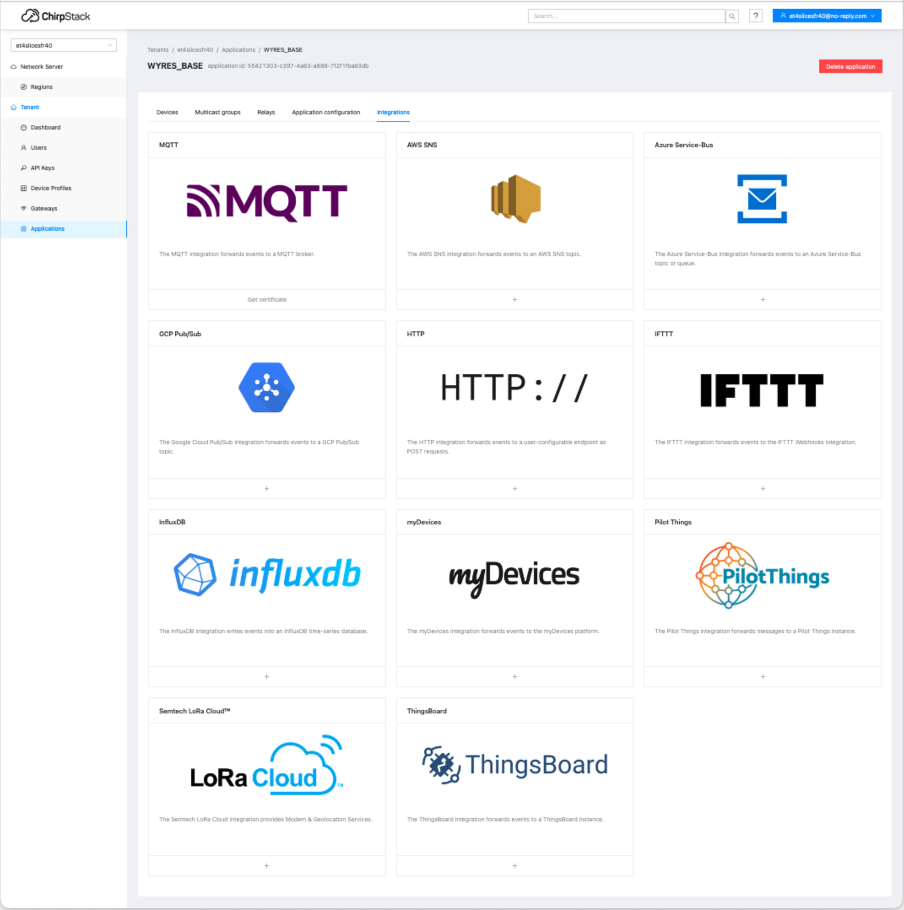

# Collecte, stockage et affichage des mesures de capteurs LoRaWAN

[Précédent](07b.md) | [Sommaire](README.md) |  [Suivant](08a.md)

Dans ce chapitre, vous apprendrez à
* intégrer les mesures de capteurs LoRaWAN dans des plateformes IoT Cloud
* collecter, stocker et afficher les mesures de capteurs LoRaWAN dans des applications on-premise
* utiliser des archives de mesures de capteurs LoRaWAN pour des analyses

Chirpstack v4 offre [plusieurs types d'intégration](https://www.chirpstack.io/docs/chirpstack/integrations/index.html) des [événements produits](https://www.chirpstack.io/docs/chirpstack/integrations/events.html):

* `up` - Uplink event
* `status` - Margin and battery status
* `join` - Device join event
* `ack` - Confirmed downlink (n)ack
* `txack` - Downlink transmission ack
* `log` - Log (or error) event
* `location` - Location event
* `integration` - Integration event

Nous nous intéresserons surtout aux événements `up` qui portent les données applicatives

Sous-chapitres

* [Console de prévisualisation des mesures](08h.md)
* [Nodered - Influxdb - Grafana (on premise)](08a.md)
* [Thingsboard (cloud)](08b.md)
* [Thingsboard (on premise)](08c.md)
* [Influx Data (cloud)](08d.md)
* [Autres plateformes IoT](08e.md)
* [Collecte en ligne de commande](08f.md)
* [Utilisation des mesures dans des Notebooks Jupyter pour le Machine Learning](08g.md)
