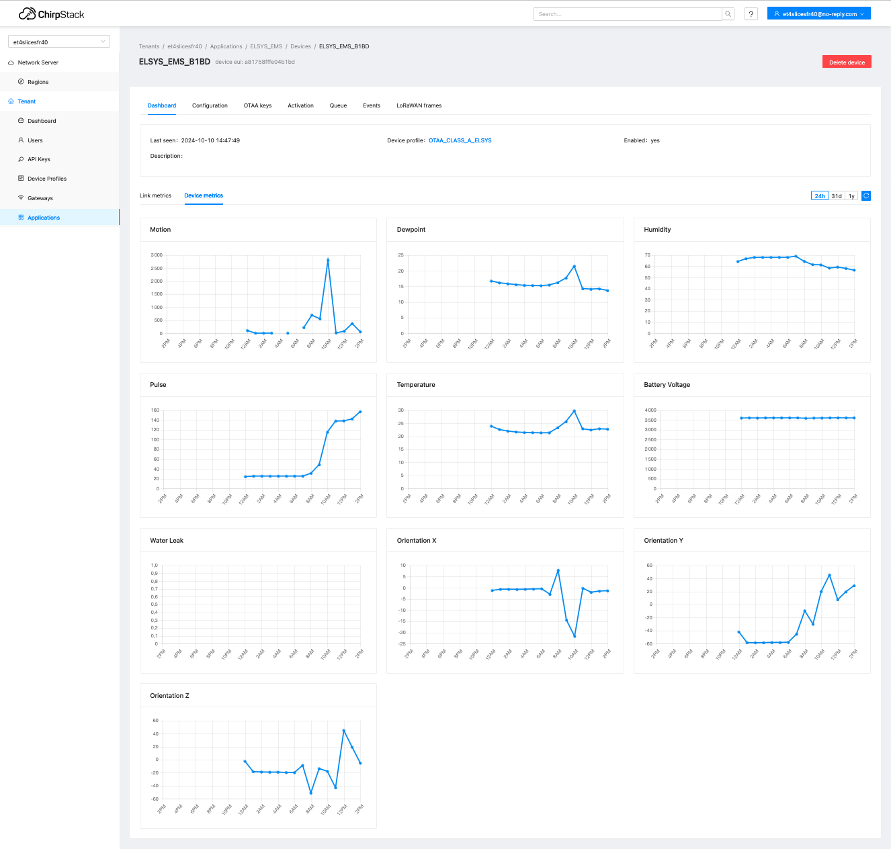

# Console de prévisualisation des mesures

[Précédent](08.md) | [Sommaire](README.md) |  [Suivant](08a.md)

Chirpstack offre une console de prévisualisation des mesures d'un device collectées et décodées au moyen du codec définie dans le `Device Profile`.

> Quand la détection automatique est activée, les clés de mesure sont automatiquement ajoutées en fonction des clés de la charge utile décodée. Si la charge utile décodée contient des clés aléatoires, il est préférable de désactiver la détection automatique.

Le tableau du device contient un onglet `Device metrics` qui comporte les graphes pour chaque mesure ajoutée (automatiquement ou dynamiquement) sur 24 heures, 1 mois et 1 an.

