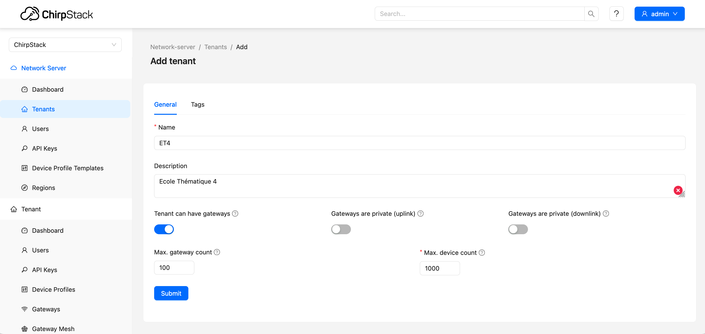
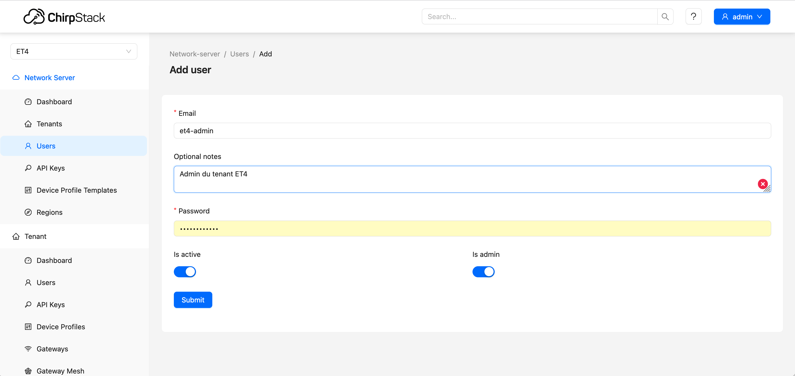

# Hébergement d'un LNS pour un réseau privé

[Précédent](08g.md) | [Sommaire](README.md) |  [Suivant](15.md)

Chirpstack peut être déployé rapidement sous dans une machine virtuelle de votre organisation, sous sur un PC ou un RPI standalone (ie au milieu de nulle part).

```bash
mkdir ~/github/chirpstack
cd ~/github/chirpstack
git clone git@github.com:chirpstack/chirpstack-docker.git
cd chirpstack-docker
```

Editez `configuration/chirpstack/chirpstack.toml` pour retirer des régions ETSI (Europe)

```toml
  enabled_regions=[
    "eu433",
    "eu868",
    "ism2400"
  ]
```

Importez les définitions d'équipements LoRaWAN commerciaux (et recensés par la communauté TTN).
```bash
make import-lorawan-devices
```

Lancez les services de Chirpstack
```bash
docker compose up -d
docker compose ps
docker compose logs -f
```

`^C` pour arrêter le suivi des journaux de services de la composition.

Ouvrez la console Web http://localhost:8080 avec `admin` `admin`

> Par souci de sécurité, il convient de changer le mot de passe de l'utilisateur `admin` via `Users` > `admin` > `Change password`.

Vous pouvez aussi consulter l'API RESTFul du service http://localhost:8090

Vous pouvez créer un nouveau [tenant](https://www.chirpstack.io/docs/chirpstack/use/tenants.html) `ET4`. Un tenant permet de séparer des groupes d'utilisateurs, des stations LoRa et des terminaux LoRaWAN. Dans la version 3 de Chirpstack, le concept d'organisation correspondait au concept de tenant.

> Remarque: les stations LoRa d'un tenant peuvent être partagées avec d'autres tenants pour les liaisons montantes ou descendantes. Des quotas peuvent être instaurés sur le nombre de stations et d'équipements dans le tenant.



Dans ce nouveau tenant, vous pouvez créer un nouvel utilisation `et4-admin` ayant les droits d'administration dans le tenant.



Cet utilisateur peut créer des nouveaux utilisateurs, ajouter des gateways et des applications, ainsi que les équipements (devices).

> Si votre LNS se trouve exposé sur le Web (adresse public), il est plus que préférable de sécuriser l'accès à la console et l'API REST avec une liaison TLS et filtrer les ports autre que `80`, `443`, `8883`, `1700/UDP`.
