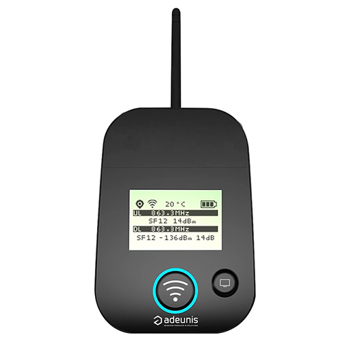
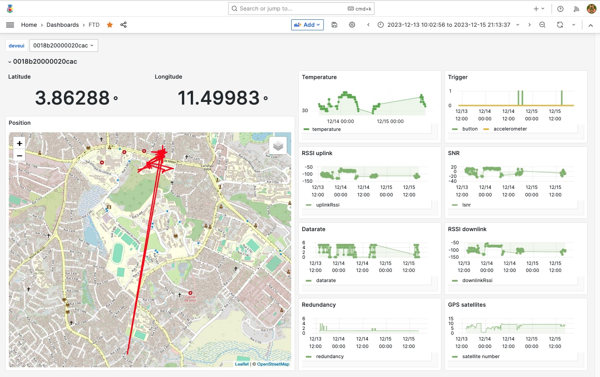

# Hébergement d'un LNS pour un réseau privé

[Précédent](08g.md) | [Sommaire](README.md) |  [Suivant](15.md)


## Installation et mise en opération d'un LNS Chirpstack v4

Chirpstack peut être déployé rapidement sous dans une machine virtuelle de votre organisation, sous sur un PC ou un RPI standalone (ie au milieu de nulle part).

```bash
mkdir ~/github/chirpstack
cd ~/github/chirpstack
git clone git@github.com:chirpstack/chirpstack-docker.git
cd chirpstack-docker
```

Editez `configuration/chirpstack/chirpstack.toml` pour retirer des régions ETSI (Europe)

```toml
  enabled_regions=[
    "eu433",
    "eu868",
    "ism2400"
  ]
```

Importez les définitions d'équipements LoRaWAN commerciaux (et recensés par la communauté TTN).
```bash
make import-lorawan-devices
```

Lancez les services de Chirpstack
```bash
docker compose up -d
docker compose ps
docker compose logs -f
```

`^C` pour arrêter le suivi des journaux de services de la composition.

Ouvrez la console Web http://localhost:8080 avec `admin` `admin`

> Par souci de sécurité, il convient de changer le mot de passe de l'utilisateur `admin` via `Users` > `admin` > `Change password`.

Vous pouvez aussi consulter l'API RESTFul du service http://localhost:8090

Vous pouvez créer un nouveau [tenant](https://www.chirpstack.io/docs/chirpstack/use/tenants.html) `ET4`. Un tenant permet de séparer des groupes d'utilisateurs, des stations LoRa et des terminaux LoRaWAN. Dans la version 3 de Chirpstack, le concept d'organisation correspondait au concept de tenant.

> Remarque: les stations LoRa d'un tenant peuvent être partagées avec d'autres tenants pour les liaisons montantes ou descendantes. Des quotas peuvent être instaurés sur le nombre de stations et d'équipements dans le tenant.


Dans ce nouveau tenant, vous pouvez créer un nouvel utilisation `et4-admin` ayant les droits d'administration dans le tenant.


Cet utilisateur peut créer des nouveaux utilisateurs, ajouter des gateways et des applications, ainsi que les équipements (devices).

> Si votre LNS se trouve exposé sur le Web (adresse public), il est plus que préférable de sécuriser l'accès à la console et l'API REST avec une liaison TLS et filtrer les ports autre que `80`, `443`, `8883`, `1700/UDP`.

## Installation et mise en opération de stations LoRa

### Les différents modèles de stations

Les stations LoRa sont équipés des composants SX130x de Semtech. Le SX130x couplé à deux SX125x écoute simulanément 2x5 canaux de 125KHz sur 2 bandes d'un MHz (soit 10 fréquences centrales) et sur 8 spreading factor (SF 5 à 12).

Les stations outdoor sont en général équipées de modules GNSS pour permettre d'opérer des terminaux en classe B (diffusion des beacons classe B).

Les modèles de stations varient principalement sur le contexte d'utilisation: Indoor, Semi Outdoor (IP55), Outdoor (IP67). Elles sont équipées d'une ou plusieurs antennes à gain internes ou externes.

Les stations LoRa doivent être reliés au LNS via un réseau IP offert soit par un réseau filiaire d'entreprise (dans un VLAN de préférence), réseau cellulaire 3G/4G/5G, réseau WLAN (Wifi) d'entreprise ou domicile, réseau satellitaire IP (Starlink, Iridium ...). Ce lien est dit "backhaul" en anglais.

En pratique, les stations des réseaux privés LoRaWAN sont configurés sur 8 canaux d'une largueur de bande de 125 KHz (`868.1`, `868.3`, `868.5`, `867.1`, `867.3`, `867.5`, `867.7`, `867.9`) et sur les SF de 7 à 12. Les trois premiers canaux sont obligatoires dans les paramêtres régionaux de la bande ESTI ISM EU868 (863 MHz - 870MHz).

> Attention, ne pas confondre les stations LoRa avec les "pico" stations mono-canal mono-SF (aka One Channel Hub)
 
> Question : Le gain des antennes (omni-directionnelles) sont de 2 dBi à 12 dBi. Le prix de l'antenne qui varie avec le gain est vite amorti par le prix du changement des batteries des terminaux. Pourquoi ?

> Remarque: Les stations TDOA permettent un estampillage fin (Fine Timestamping) qui permet de localiser les terminaux émetteurs par multi-lateration.

Le logiciel de la station sert de passe plat (montant et descendant) entre les terminaux et le LNS. Elle peut néanmoins filtrer des messages sur le DevAddr ou le JoinEUI pour allèger le lien "backhaul" avec le serveur. 

## Test de couverture du réseaux de stations LoRa

TODO







> Question: combien de stations faut-il pour couvrir une zone ?

## Surveillance du réseau

* stations : indisponibilité (backhall, vol, foudre, vandalisme, antenne mal orientée), qualité lien avec les devices, test de couverture avec les autres stations
* terminaux (device) : emplacement, batterie ...


